# Toki ✨

> A clean, full-stack task manager app with Pomodoro integration. Built from scratch to defeat tutorial hell and embrace real-world development.

---

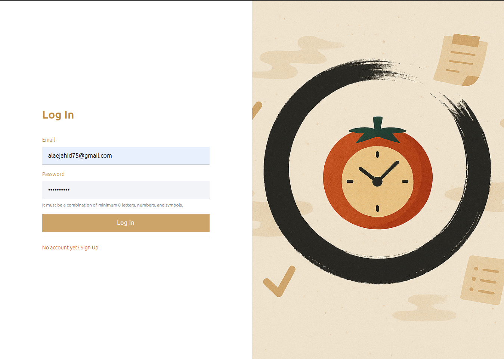

---

## 🧠 Why Toki?

Toki isn’t just another task manager — it’s the first app I’ve fully built on my own, from UI to backend logic. After months of tutorials, I wanted to break free and **build something real**, something I could iterate on, refine, and deploy. That’s how Toki was born.

---

## ✨ Features

### 📂 Task Management
- Create, update, delete tasks
- Set priority levels (high/low)
- Filter by priority
- Sort by:
  - Recent updates
  - Due date
  - Estimated time
  - Progress (based on Pomodoro sessions)
- Toggle between **Board View** (card layout) and **List View** (rows)

### 🍅 Pomodoro Integration
- Focus, Short Break, Long Break sessions
- Auto-starts **Breaks** after focus ends
- **Manual-start for Focus** (ensures user is ready to work)
- Tracks focus sessions per task

### 🎨 User Customization
- Set your own Pomodoro durations
- Customize session colors (Focus, Breaks)
- Change password and set a fun username

### 🔐 Authentication & Security
- JWT-based login/register
- Auto-removal of expired tokens via Axios interceptor
- Redirection to login + toast when session expires

### 📱 Visuals & UX
- Fully responsive (desktop & mobile)
- Clean, intuitive interface
- Animated icons & tooltips for better guidance

### 💡 Dynamic Motivation System
Each task generates a unique motivational quote based on:
- Estimated time
- Time left before deadline
- Sessions completed

It’s a tiny system that nudges you to **break it down, focus, and win.**

---

## 📰 Live Demo

Try Toki in action:

🔗 [click here for live demo](https://toki-xichromes-projects.vercel.app)

---

## 🐋 Docker Support

Toki is fully Dockerized with production-ready builds for both the **frontend** and **backend**.

You can spin up both with:

```bash
docker compose up --build
```

This runs:
- A **React + Vite frontend** 
- A **Spring Boot backend**, connected to a **cloud-hosted PostgreSQL database**

### 💠 Customize for Local Dev (Optional)

If you'd like to run **everything 100% locally**, including the backend and database:

1. **Uncomment** the db service inside docker-compose.yml.
2. **Create your local .env file**:

   ```env
   # FRONTEND
   VITE_BACKEND_URL=http://localhost:8080

   # BACKEND
   SPRING_DATASOURCE_URL=jdbc:postgresql://db:5432/tokidb
   SPRING_DATASOURCE_USERNAME=postgres
   SPRING_DATASOURCE_PASSWORD=tokipass
   JWT_SECRET=some-random-long-secret
   ```

   
3. **Expose the right port** in your frontend Dockerfile:
   ```dockerfile
   EXPOSE 3000
   CMD ["npx", "serve", "-l", "3000", "dist"]
   ```


## 📸 Screenshots

### 🔑 Authentication

| **Login** | **Register** |
|----------|--------------|
| 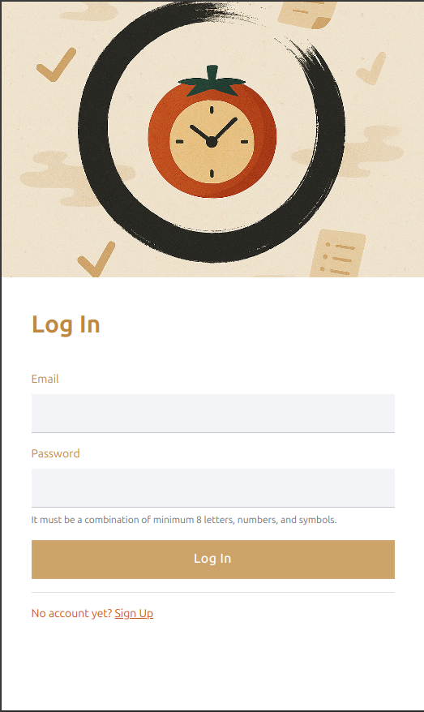 | 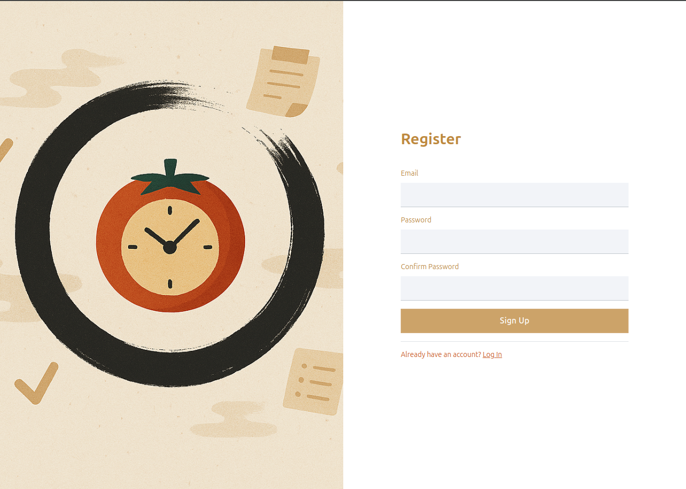 |

---

### 🏠 Dashboard & Task Management

| **Dashboard – Board View** | **Dashboard – List View** |
|----------------------------|----------------------------|
| 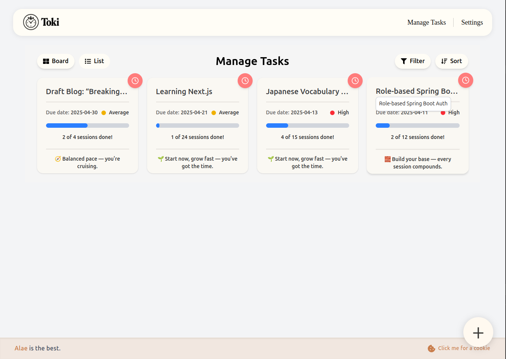 | 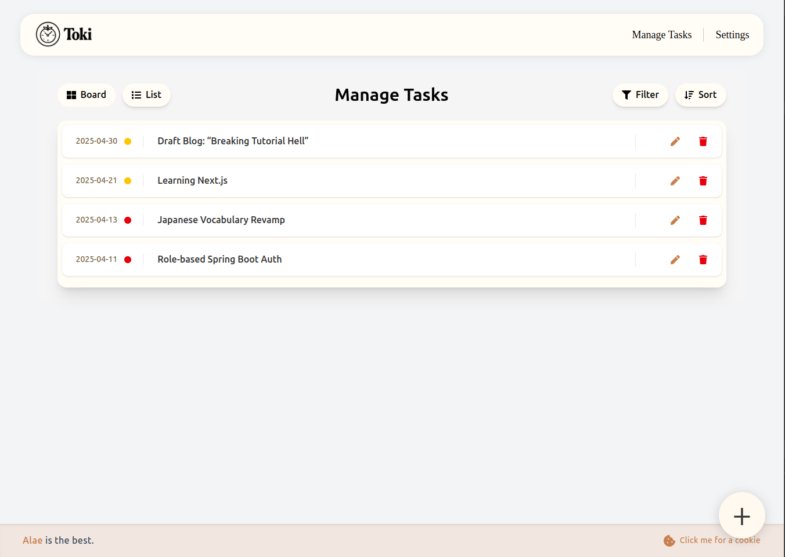 |

- **Sort & Filter:**
  | Sorting | Filtering |
  |---------|-----------|
  |  | 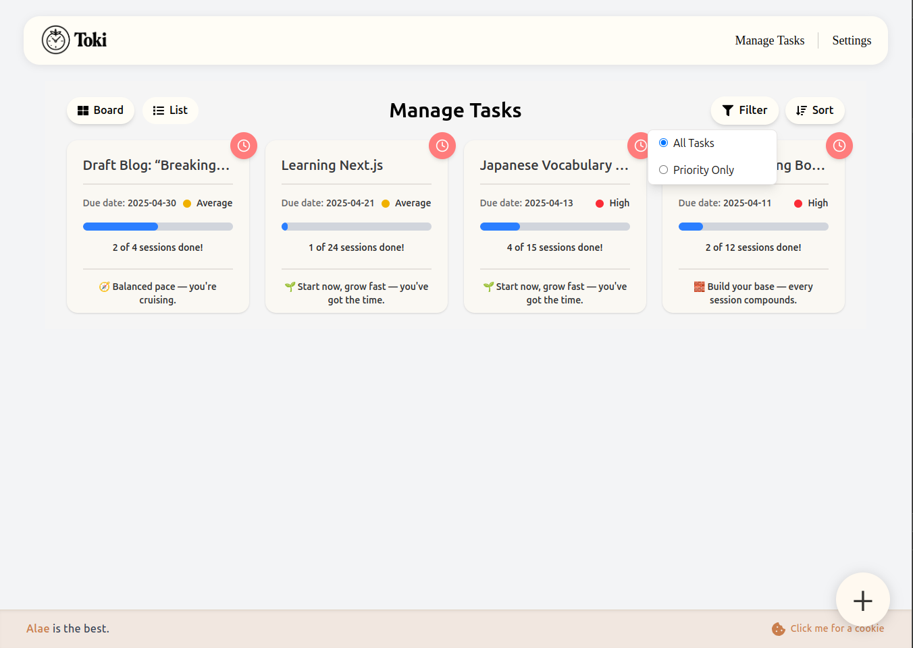 |

- **Add / Edit Tasks:**
  | Add Task | Edit Task |
  |----------|-----------|
  | 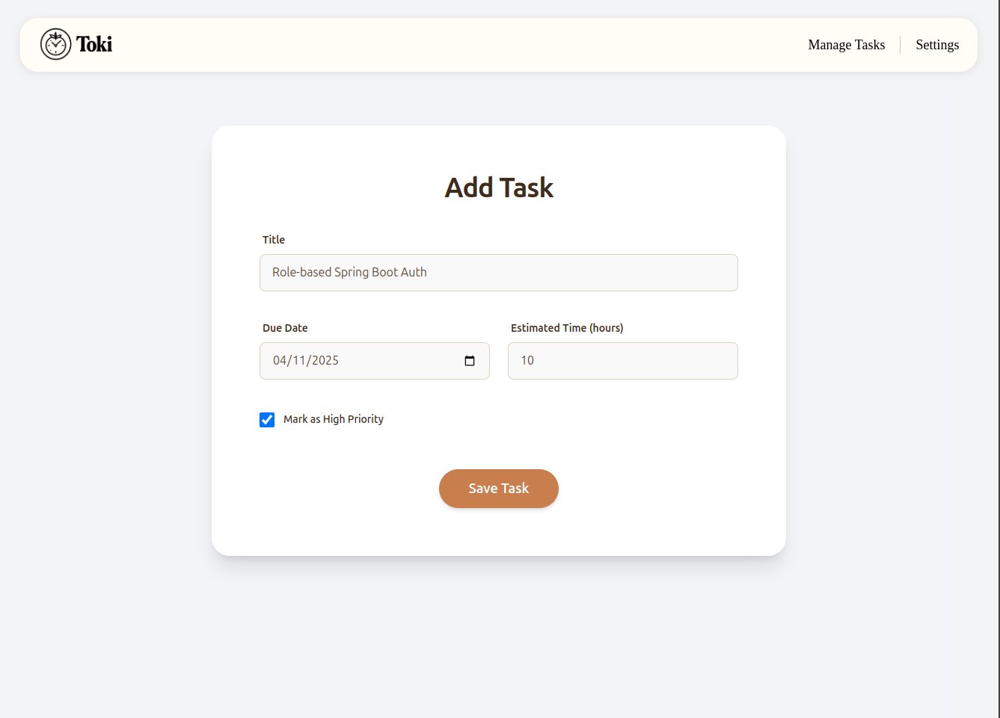 | 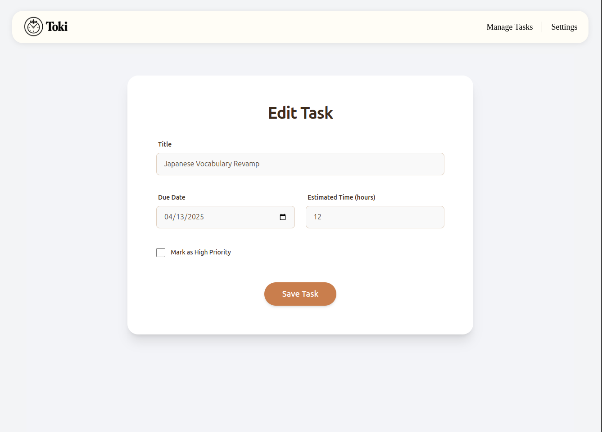 |

- **Empty State:**
  > When no tasks are found, Toki welcomes you with a sad tomato 🍅
  

---

### ⏱️ Pomodoro Sessions

| **Focus** | **Short Break** | **Long Break** |
|----------|------------------|----------------|
| 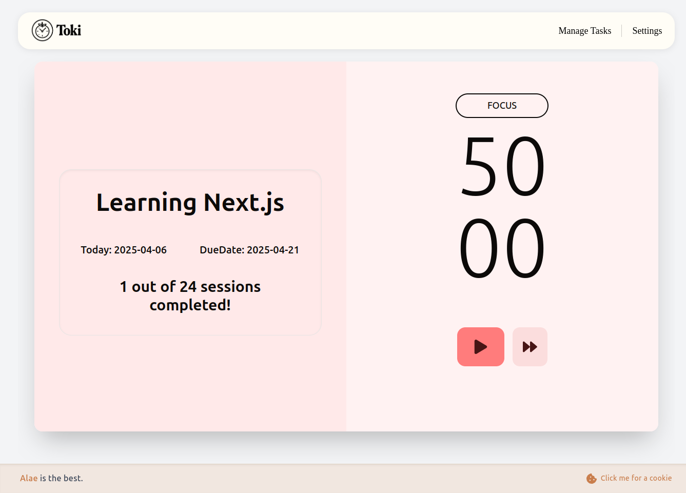 | 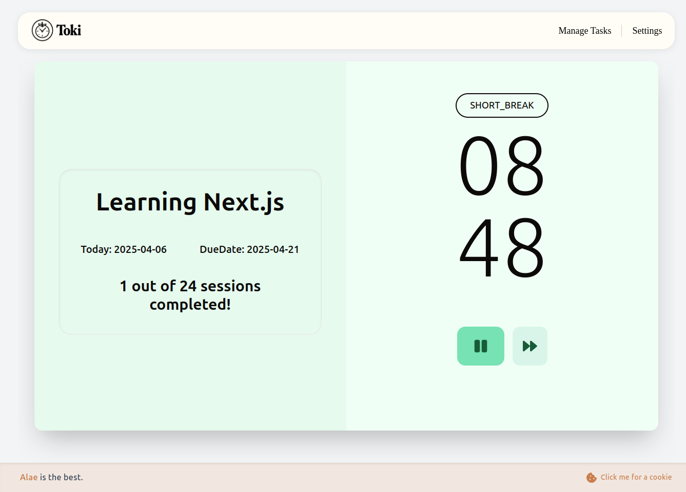 | 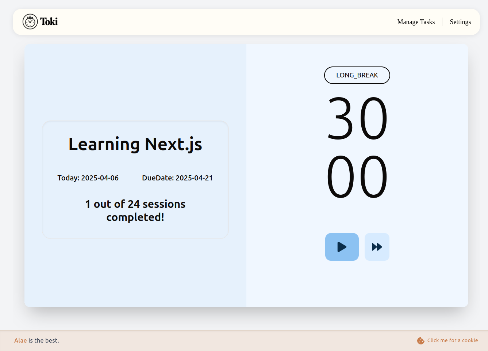 |

> Sessions auto-switch from Focus → Break, and wait for manual confirmation before Focus restarts.

---

### ⚙️ Settings

| **Durations / Theme** | **Profile Tab (Username & Password)** |
|------------------------|---------------------------------------|
| 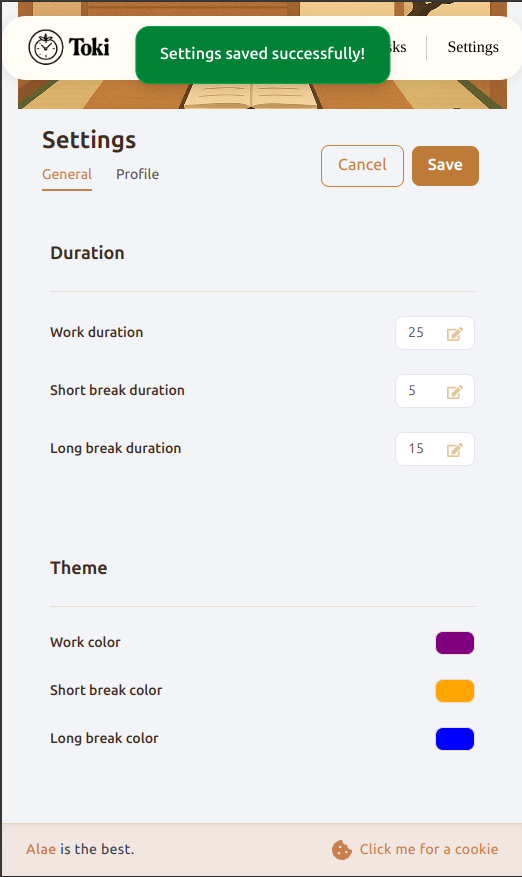 | 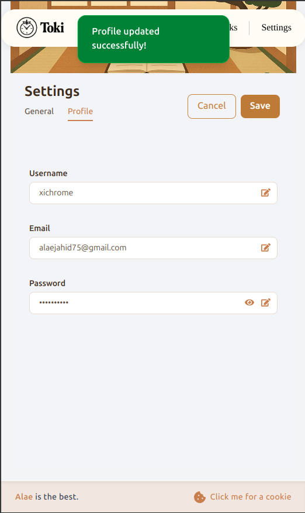 |

---

### 📱 Mobile Experience

| **Dashboard** | **Pomodoro** |
|---------------|--------------|
| 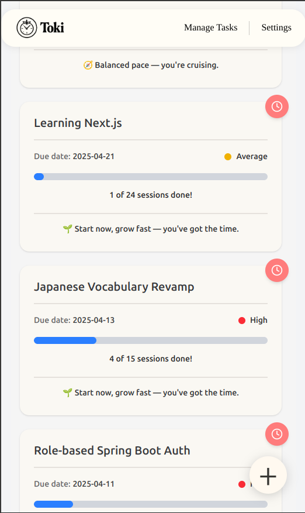 | 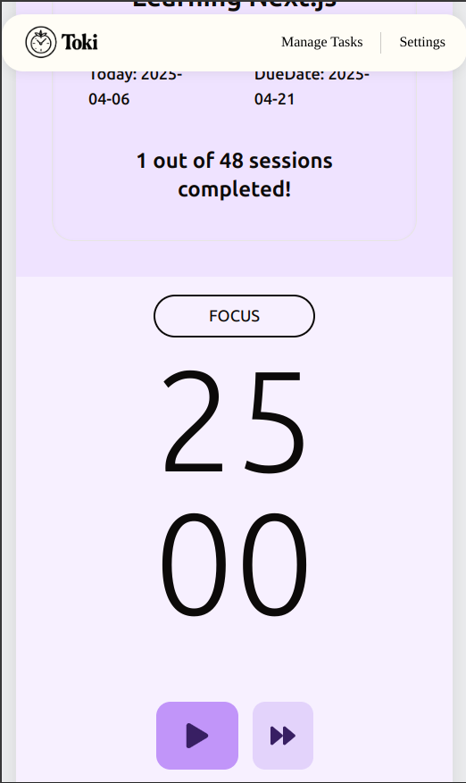 |

---

## 🛠️ Tech Stack

### Frontend
- React + TypeScript
- TailwindCSS
- Axios
- Vite

### Backend
- Spring Boot
- Spring Security (JWT)
- PostgreSQL / H2
- RESTful APIs

---

## 📁 Project Structure

```
frontend/src
├── App.tsx                  # Main app entry
├── assets/images            # Logos, illustrations, mascot
├── components/              # Layout, Navbar, Toasts, Floating Add Btn
├── features/
│   ├── auth                 # Login/Register forms + pages
│   ├── pomodoro             # Timer logic and UI
│   ├── settings             # Theme, duration, profile
│   └── tasks                # Task views, forms, filters
├── hooks/                   # useTasks, useOverflow (for UI)
├── services/                # API abstraction layer
├── routes/                  # Client-side routing
└── types/                   # Shared types

backend/src/main/java/com/taskmanager/taskmanager
├── entity/                  # Task, User, UserSettings
├── repository/              # Data access layers
├── service/                 # Business logic (Task, User, Settings)
├── security/                # JWT config, filter, controller
├── web/                     # REST controllers
└── ApplicationExceptionHandler.java
```

---

## 👨‍💻 About the Author

Hey! I'm **Alae**, a **first-year software engineering student** from Morocco 🇲🇦.

Toki is the **first real app** I’ve built after escaping tutorial hell — a full-stack project that challenged me to understand architecture, flow, and deployment from scratch.

My dream? To **work or intern in Japan** and grow through purposeful development.

> [LinkedIn Post – Read My Journey](https://www.linkedin.com/posts/alae-j_react-springboot-typescript-activity-7314630940557758464-Mjp5?utm_source=share&utm_medium=member_desktop&rcm=ACoAAFFe4T4BHDpxbykZe3TD05IcNi1FlZSi0tw)

---

## 📃 License

This project is not licensed. It’s a personal learning milestone.

---

*Built with grit, vision, and a tomato.* 🍅